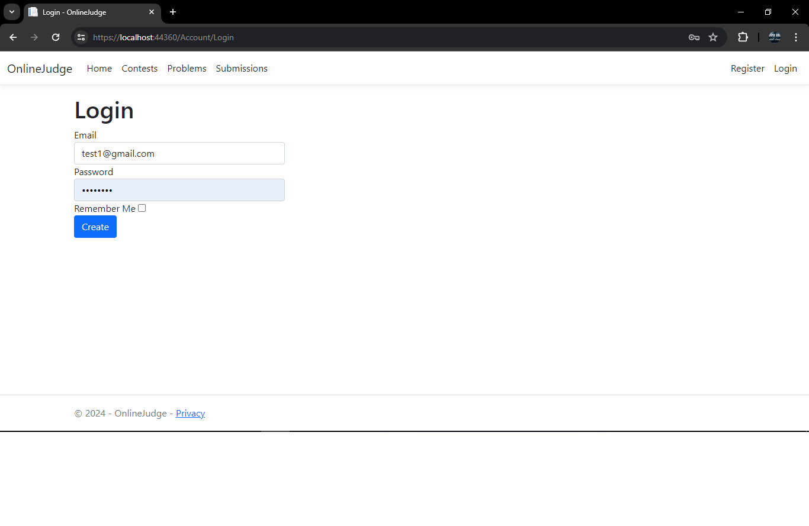

# OnlineJudge

A simple online judge website. Problem setting is made much easier: Just provide the solution with input test and expected output.

This online judge has the simple features that's found in every online judge:

- User can register and login, every user has a unique handle that appears in standing and in submission page.
- User can make a contest. A contest should have a name, start date and end date.
- User can make a problem. A problem should have a contest id, title, statement, solution code, input test and expected output
  (notice that user can't add a problem to a contest with id that he didn't make).
- User can register/unregister in contest and participate (notice that once contest started, user can't unregister).
- User can make a submit in contest. Submission can be made in the problem page (in this case user only provide the code)
  or in main submissions page (in this case user should provide the code and the problem id).
- User can only open view his submissions.
- During contest problems don't appear in problem set page , but only in contest page.
  After the contest time end the problems appear in problem set page.
- Only user who created a contest/problem can edit or delete it.
- Currently, the online judge supports only C/C++. In the future, we plan to support multiple programming languages.
- We don't support taking input or output from standard streams, we use files.

## Technologies
- C#
- ASP.NET Core 8.1
- MSSQL Server
- Identity Framework
- HTML, CSS, Java Script, Bootstrap

## Database Diagram

## Screenshots

Click to toggle Screenshots

  
Register

Login

Home Page

Contest Home

Create Contest

Contest Details

Edit Contest

Delete Contest

Problems Home

Create Problem

Problem Details

Edit Problem

Problems In Contest

Standing

Submissions

Submissions

